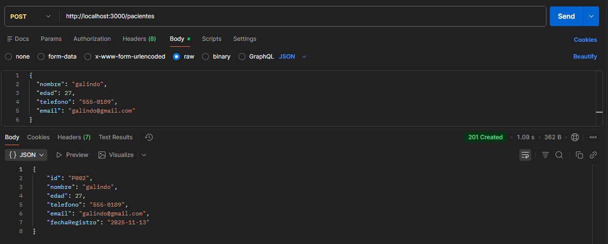
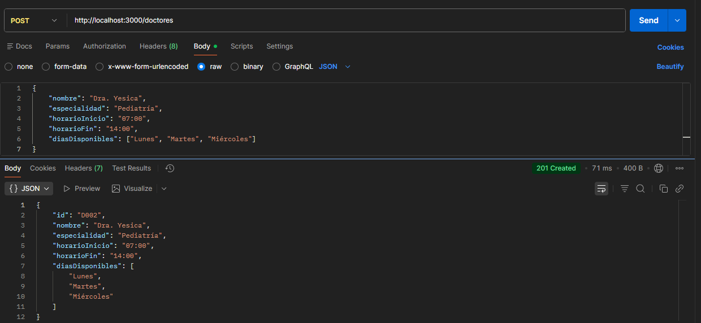
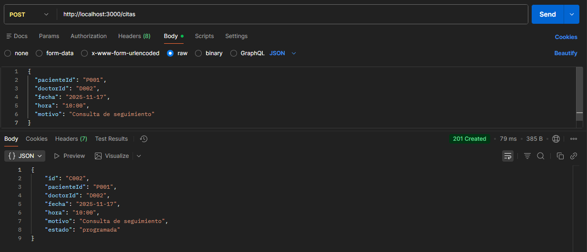
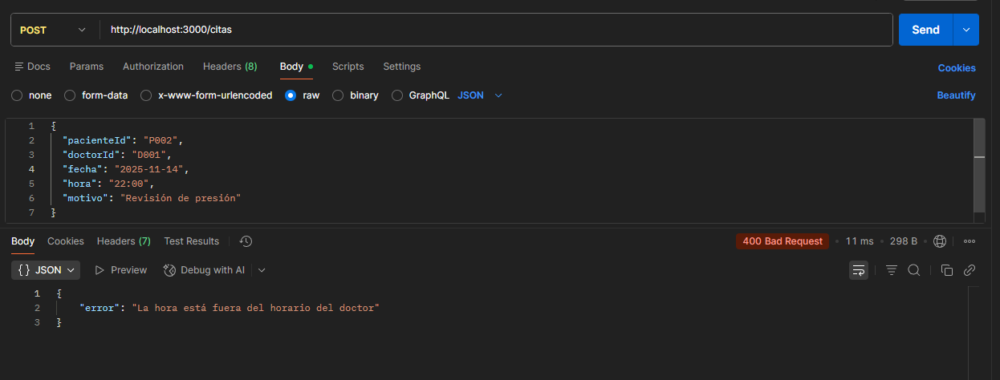
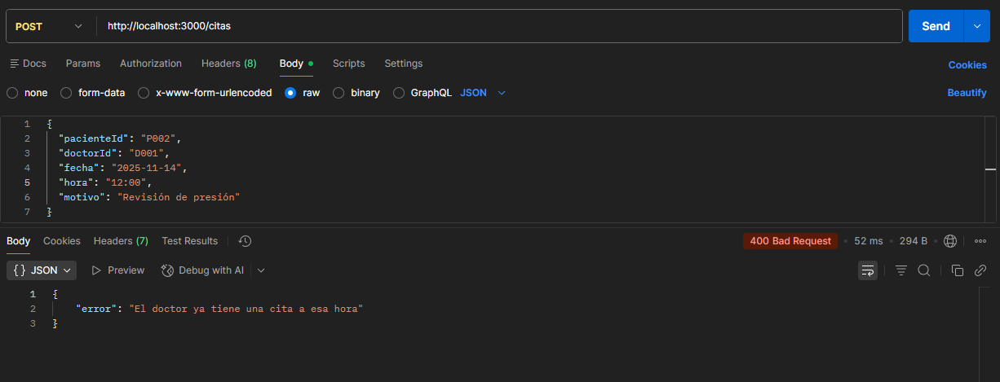
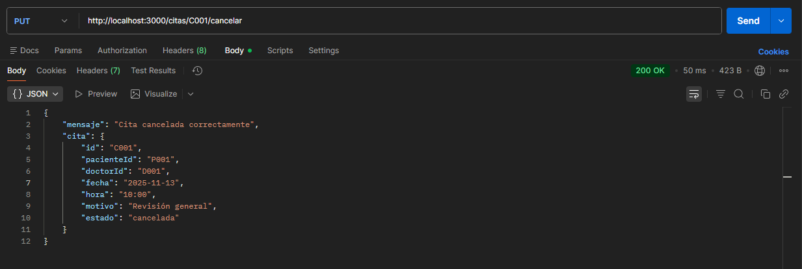
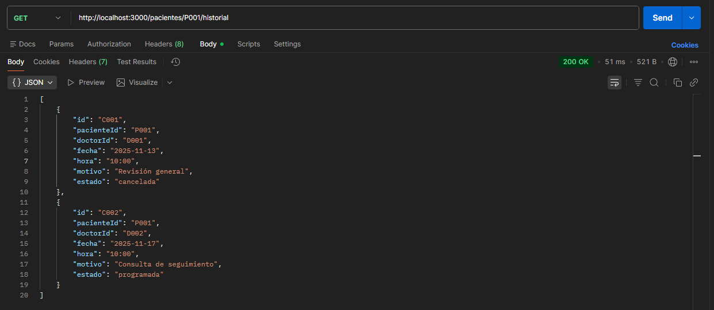

# LABORATORIO-APIS-EVALUACION

# Portada Institucional

Instituto Tecnologico de Ensenada  
Ingeniería en Sistemas computacionales  
Desarrollo Web 1  
Práctica Integradora – Sistema de Gestión de Citas Médicas  
**Misael Castillo Rios**   
Xenia Padilla Madrid  
13 de noviembre del 2025

---

# Descripción 

Este proyecto consiste en la creación de una **API REST** para administrar citas médicas.  
Permite registrar pacientes, doctores, agendar citas, cancelarlas, obtener estadísticas y consultar citas próximas.  
Utiliza **archivos JSON como base de datos**.

---

# Instrucciones de Instalación

1. Clonar el repositorio
    ``` bash
    git clone [https://github.com/MisaelCast/LABORATORIO-APIS-EVALUACION.git]
    ```

2.  Instalar dependencias:

    ``` bash
    npm install
    ```

3.  Instalar nodemon (opcional pero recomendado)

    ``` bash
    npm install --save-dev nodemon
    ```

4.  Agregar script en `package.json`:

    ``` json
    "scripts": {
      "start": "nodemon server.js"
    }
    ```

5.  Iniciar el servidor:

    ``` bash
    npm start
    ```

**Estructura del Proyecto**

    LABORATORIO-APIS-EVALUACION/
    ├── data/
    │   ├── pacientes.json
    │   ├── doctores.json
    │   └── citas.json
    ├── utils/
    │   └── fileManager.js
    ├── server.js
    └── package.json
    
------------------------------------------------------------------------

# Documentación de Endpoints --- API Clínica Médica

Esta documentación describe alguno de los **endpoints** del sistema de gestión de
pacientes, doctores y citas.
Los endpoints son las rutas que permiten que un cliente (Postman,
frontend, móvil, etc.) se comunique con el servidor.
Son importantes porque:
- Permiten **crear, leer, actualizar y gestionar** la información del
sistema.
- Aseguran que los datos estén **bien validados** y cumplan reglas de
negocio.
- Mantienen una estructura clara y estandarizada mediante el estilo
**RESTful**.

------------------------------------------------------------------------

# Endpoints de Pacientes

## POST /pacientes

Registrar un nuevo paciente.

### Request:

``` json
{
  "nombre": "Jorge",
  "edad": 18,
  "telefono": "555-0121",
  "email": "jorge@gmail.com"
}
```

### Response:

``` json
{
  "mensaje": "Paciente registrado",
  "paciente": {
    "id": "P003",
    "nombre": "Jorge",
    "edad": 18,
    "telefono": "555-0121",
    "email": "jorge@gmail.com",
    "fechaRegistro": "2025-11-12"
  }
}
```

------------------------------------------------------------------------

## GET /pacientes

Listar todos los pacientes.

### Response:

``` json
[
  {
    "id": "P001",
    "nombre": "María González",
    "edad": 35,
    "telefono": "555-0101",
    "email": "maria@email.com"
  },
  {
    "id": "P002",
    "nombre": "Luis Pérez",
    "edad": 40,
    "telefono": "555-0202",
    "email": "luis@gmail.com"
  }
]
```

------------------------------------------------------------------------

## GET /pacientes/:id

Obtener un paciente por ID.

### Response:

``` json
{
  "id": "P001",
  "nombre": "María González",
  "edad": 35,
  "telefono": "555-0101",
  "email": "maria@gmail.com"
}
```

------------------------------------------------------------------------

## GET /pacientes/:id/historial

Consultar historial de citas del paciente.

### Response:

``` json
[
  {
    "id": "C002",
    "fecha": "2025-11-12",
    "hora": "10:00",
    "doctor": "Dr. Carlos Méndez",
    "motivo": "Chequeo anual",
    "estado": "programada"
  }
]
```

------------------------------------------------------------------------

# Endpoints de Doctores

## POST /doctores

Registrar un nuevo doctor.

### Request:

``` json
{
  "nombre": "Dr. Juan Ruiz",
  "especialidad": "Dermatología",
  "horarioInicio": "08:00",
  "horarioFin": "14:00",
  "diasDisponibles": ["Lunes", "Miércoles", "Viernes"]
}
```

### Response:

``` json
{
  "mensaje": "Doctor registrado",
  "doctor": {
    "id": "D003",
    "nombre": "Dr. Juan Ruiz",
    "especialidad": "Dermatología",
    "horarioInicio": "08:00",
    "horarioFin": "14:00",
    "diasDisponibles": ["Lunes", "Miércoles", "Viernes"]
  }
}
```

------------------------------------------------------------------------

## GET /doctores/especialidad/:especialidad

Buscar doctores por especialidad.

### Response:

``` json
[
  {
    "id": "D001",
    "nombre": "Dr. Carlos Méndez",
    "especialidad": "Cardiología"
  }
]
```

------------------------------------------------------------------------

# Endpoints de Citas

## POST /citas

Agendar una nueva cita.

### Request:

``` json
{
  "pacienteId": "P001",
  "doctorId": "D001",
  "fecha": "2025-12-11",
  "hora": "12:00",
  "motivo": "Dolor de pecho"
}
```

### Response:

``` json
{
  "mensaje": "Cita creada exitosamente",
  "cita": {
    "id": "C006",
    "pacienteId": "P001",
    "doctorId": "D001",
    "fecha": "2025-12-11",
    "hora": "12:00",
    "motivo": "Dolor de pecho",
    "estado": "programada"
  }
}
```

------------------------------------------------------------------------

## PUT /citas/:id/cancelar

Cancelar una cita programada.

### Response:

``` json
{
  "mensaje": "Cita cancelada",
  "cita": {
    "id": "C002",
    "estado": "cancelada"
  }
}
```

------------------------------------------------------------------------

## GET /citas?fecha=YYYY-MM-DD&estado=programada

Consultar citas filtradas.

### Response:

``` json
[
  {
    "id": "C003",
    "fecha": "2025-11-13",
    "hora": "15:00",
    "pacienteId": "P001",
    "doctorId": "D001",
    "estado": "programada"
  }
]
```

------------------------------------------------------------------------

# Endpoints de Estadísticas

## GET /estadisticas/doctores

Devuelve el doctor con más citas.

### Response:

``` json
{
  "doctor": "Dr. Carlos Méndez",
  "totalCitas": 4
}
```

------------------------------------------------------------------------

## GET /estadisticas/especialidades

Devuelve la especialidad más solicitada.

### Response:

``` json
{
  "especialidad": "Cardiología",
  "total": 5
}
```

------------------------------------------------------------------------

# Notificaciones

## GET /citas/proximas

Citas dentro de las siguientes 24 horas.

### Response:

``` json
[
  {
    "id": "C002",
    "pacienteId": "P002",
    "doctorId": "D001",
    "fecha": "2025-11-12",
    "hora": "10:00"
  }
]
```

------------------------------------------------------------------------

## **Casos de Prueba Realizados**

### ✔ Crear paciente



### ✔ Crear doctor



### ✔ Agendar cita



### ❌ Agendar cita en horario no disponible


### ❌ Dos citas al mismo doctor a la misma hora


### ✔ Cancelar una cita


### ✔ Consultar historial de un paciente


------------------------------------------------------------------------

## **Fin del Documento**
